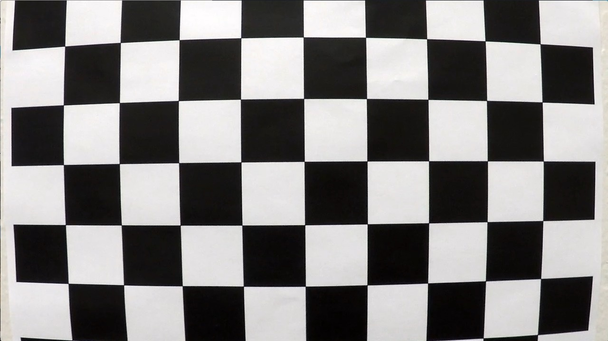
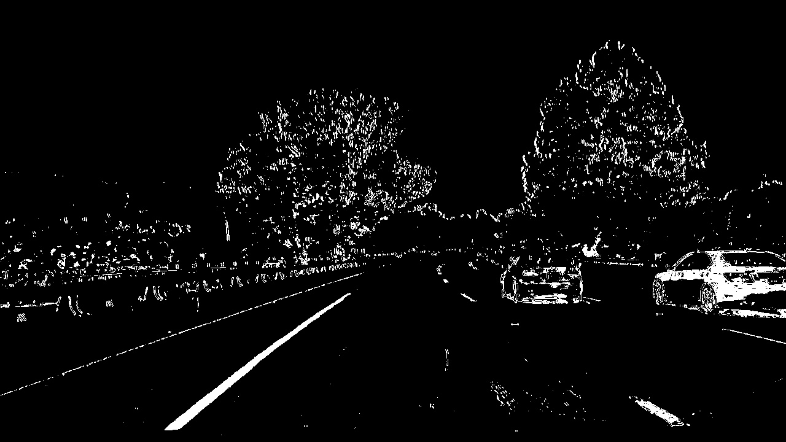
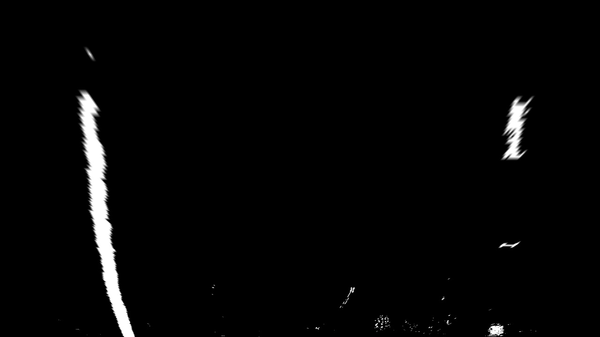
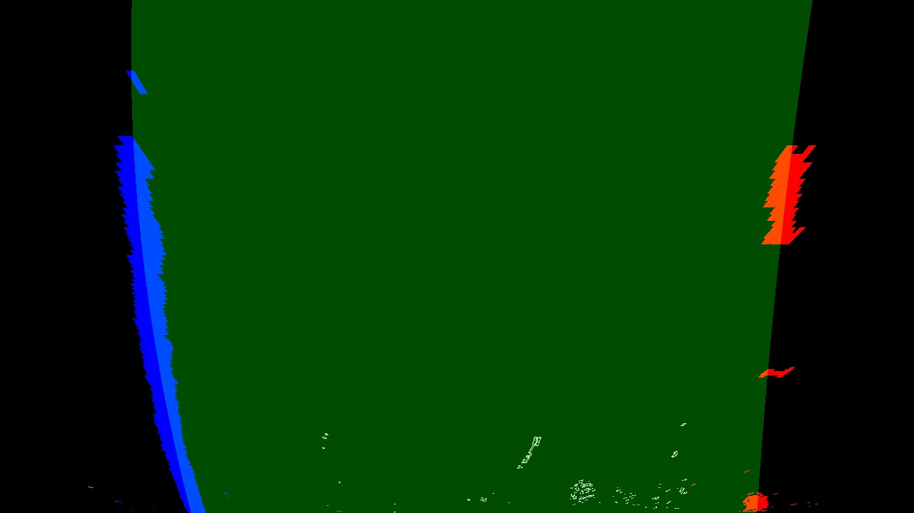
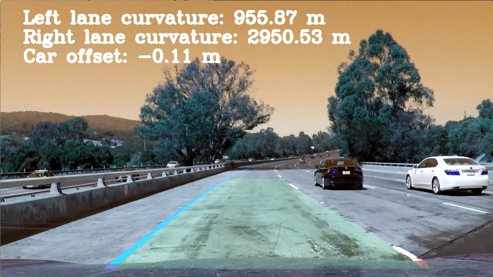

**Advanced Lane Finding Project**

The goals / steps of this project are the following:

* Compute the camera calibration matrix and distortion coefficients given a set of chessboard images.
* Apply a distortion correction to raw images.
* Use color transforms, gradients, etc., to create a thresholded binary image.
* Apply a perspective transform to rectify binary image ("birds-eye view").
* Detect lane pixels and fit to find the lane boundary.
* Determine the curvature of the lane and vehicle position with respect to center.
* Warp the detected lane boundaries back onto the original image.
* Output visual display of the lane boundaries and numerical estimation of lane curvature and vehicle position.

[//]: # (Image References)

[image1]: ./examples/undistort_output.png "Undistorted"
[image2]: ./test_images/test1.jpg "Road Transformed"
[image3]: ./examples/binary_combo_example.jpg "Binary Example"
[image4]: ./examples/warped_straight_lines.jpg "Warp Example"
[image5]: ./examples/color_fit_lines.jpg "Fit Visual"
[image6]: ./examples/example_output.jpg "Output"
[video1]: ./project_video.mp4 "Video"

## [Rubric](https://review.udacity.com/#!/rubrics/1966/view) Points

### Here I will consider the rubric points individually and describe how I addressed each point in my implementation.  

---

### Writeup / README

#### 1. Provide a Writeup / README that includes all the rubric points and how you addressed each one.  You can submit your writeup as markdown or pdf.  [Here](https://github.com/udacity/CarND-Advanced-Lane-Lines/blob/master/writeup_template.md) is a template writeup for this project you can use as a guide and a starting point.  

This file!

### Camera Calibration

#### 1. Briefly state how you computed the camera matrix and distortion coefficients. Provide an example of a distortion corrected calibration image.

The code for this step is contained in the second code cell of the IPython notebook located in "./Advanced_Lane_Finding.ipynb"   

First I create the object points for a 9 by 6 grid for the world coordinates of the chessboard corners. Given that the chessboard if fixed on the x,y plane with z fixed at 0. To calculate the transformation matrix I looped through the calibration images ( shots of the checkboard from various angles and in various part of the photo) to populate the imgpoints array with the x,y coordinates.

Having the two arrays, objpoints with the same array repeated for each calibration image, and imgpoints with respective coordinates I used `cv2.calibrateCamera()` function to compute camera calibration matrix (mtx) and distortion coefficents to use for correct distortion later on all the images using the `undistort()` wrapper funcion defined on the first code cell.

### Pipeline (single images)

#### 1. Provide an example of a distortion-corrected image.

To test the undistort function using the camera calibration matrix (mtx) and distortion coefficents (dist) from the camera calibration steps, and the `undistort()`, which call `cv2.undistort()`, I made a test with the camera calibration images:
<div style="float:left;width:49%;text-align:center">
Original calibration image <br>


</div>
<div style="float:left;width:49%;text-align:center">
Calibration image corrected <br>


</div>
<div style="clear:both"><br></div>

#### 2. Describe how (and identify where in your code) you used color transforms, gradients or other methods to create a thresholded binary image.  Provide an example of a binary image result.

I used the color_gradient function developed during the lessons applying also a Sobel filter to the h channel and to generate a binary thresholded image. The code is visible on the fourth code cell. Here's an example of my output for this step from one of the test images.

<div style="float:left;width:49%;text-align:center">
Test image <br>


</div>
<div style="float:left;width:49%;text-align:center">
Output <br>


</div>
<div style="clear:both"><br></div>

#### 3. Describe how (and identify where in your code) you performed a perspective transform and provide an example of a transformed image.

The code for the perspective transform includes a function called `warp()`, which appears in the fifth code cell along with its counterpart `unwarp()`.  The `warp()` function takes as inputs an image (`img`). The source and destination points used are:

```python
src = np.float32([[600,465],[250,700],[1125,700],[720,465]])
dst = np.float32([[250,0],[250,img.shape[0]],[1060,img.shape[0]],[1060,0]])
```

This resulted in the following source and destination points:

| Source        | Destination   | 
|:-------------:|:-------------:| 
| 600, 465      | 250, 0        | 
| 250, 700      | 250, 720      |
| 1125, 700     | 1060, 720     |
| 720, 465      | 1060, 0       |

Here's an example of my output for this step from one of the test images.

<div style="float:left;width:49%;text-align:center">
Input image <br>


</div>
<div style="float:left;width:49%;text-align:center">
Output <br>


</div>
<div style="clear:both"><br></div>

#### 4. Describe how (and identify where in your code) you identified lane-line pixels and fit their positions with a polynomial?

Next in the cells 6 and 7 I wrote to couple of methods to identify the lane lines and fit the ploynomial. In cell 6 there is the code used to make a full search of the lane markings, while in cell 7 the methods levarage preceding polynomials to try to fit actual lane lines. If there is no match a full search is done else the new polynomial is calculated with a smoothing over the past 5 calulated polynomials.

<div style="float:left;width:49%;text-align:center">
Input image <br>


</div>
<div style="float:left;width:49%;text-align:center">
Output <br>


</div>
<div style="clear:both"><br></div>

#### 5. Describe how (and identify where in your code) you calculated the radius of curvature of the lane and the position of the vehicle with respect to center.

Radius calculation is taken in cell 9. The code i s almost the same as the one from the lessons with paramtrized ratio of px per meters both for x and y. Distance to center is done with the code from cell 10.

#### 6. Provide an example image of your result plotted back down onto the road such that the lane area is identified clearly.

The code in cell 11 visualize calulations from cell 9 and 10 over the frame.

<div style="text-align:center">
Final frame <br>


</div>
</div>
<div style="clear:both"><br></div>

---

### Pipeline (video)

#### 1. Provide a link to your final video output.  Your pipeline should perform reasonably well on the entire project video (wobbly lines are ok but no catastrophic failures that would cause the car to drive off the road!).

Here's a [link to my video result](./output_images/project_out.mp4)
I also tried the [Challenge video](./output_images/challenge_video.mp4) and [Harder Challenge video](./output_images/harder_challenge_video.mp4), but results are not so good.

---

### Discussion

#### 1. Briefly discuss any problems / issues you faced in your implementation of this project.  Where will your pipeline likely fail?  What could you do to make it more robust?

Up to this point I follwed more or less the approach from the lessons. I tried to apply a mask to eliminate some false lane marks, but it didn't worked out very well. Also the warp parameters are good, but probably not the best, as well as the parameters for color/gradient used. 
Something to investigate viewing the harder challenge video is to regulate the frame general luminosity. Also probably create a mask for each frame based on previous plus a margin could probably help out in better identifying lane lines.
